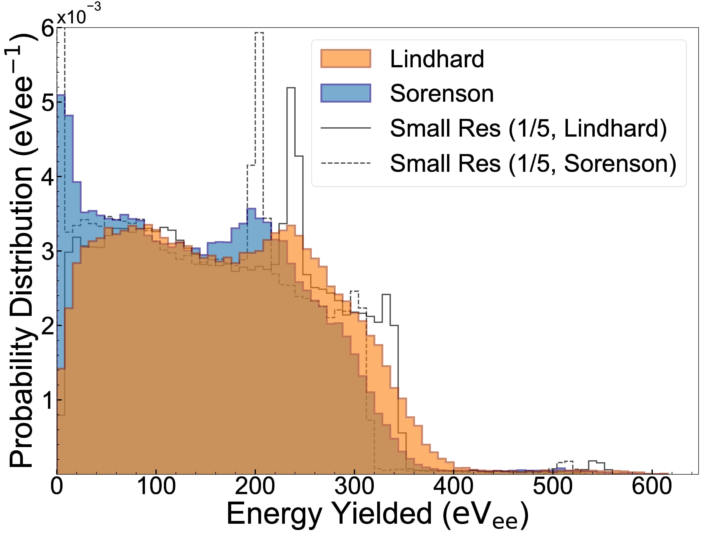

[](https://dl.circleci.com/status-badge/redirect/gh/villano-lab/nrCascadeSim/tree/master)
[](https://github.com/villano-lab/nrCascadeSim/actions/workflows/test.yml)
[](https://nrcascadesim.readthedocs.io/en/latest/?badge=latest)
[](https://opensource.org/licenses/MIT)
[](https://arxiv.org/abs/2104.02742)
[](https://codecov.io/gh/villano-lab/nrCascadeSim)

# nrCascadeSim - a tool for generating nuclear recoil spectra resulting from neutron capture

<!---[](https://joss.theoj.org/papers/fd8076268036956d3bf08193c4fc2db9)-->
[](https://joss.theoj.org/papers/d69ced49c5c17fdbf637e0747d815deb)
[](https://doi.org/10.5281/zenodo.5579857) <br/>

A C/C++ set of executables and library for computing the nuclear recoil spectra left behind by capturing neutrons when all the capture gammas escape the medium. 



You can find more detailed documentation of *nrCascadeSim* [here](https://nrcascadesim.readthedocs.io/en/latest/index.html). The documentation contains e.g. a [guide to get started](https://nrcascadesim.readthedocs.io/en/latest/01_Getting_Started.html).

## CITATION

If you decide to use this code, or if you want to add a reference to it, please cite the latest archived version,

> Villano, A.N., Harris, K., Brown, S. , 2022, nrCascadeSim - A tool for generating nuclear recoil spectra resulting from neutron capture [Code, v1.4.1] [[DOI:10.5281/zenodo.5579857]](https://zenodo.org/record/5579857).

```
@software{nrcascadesim,
  author = {Villano, A.N. and Harris, K. and Brown S.},
  title = {{nrCascadeSim - A tool for generating nuclear recoil spectra resulting from neutron capture [Code, v1.4.1]}},
  year         = {2022},
  publisher    = {Zenodo},
  version      = {v1.4.1},
  doi          = {DOI:10.5281/zenodo.5579857},
  url          = {https://doi.org/10.5281/zenodo.5579857},
  howpublished={The code can be found under \url{https://github.com/villano-lab}.}
}
```

## VERSION HISTORY

- 07.12.2022: Release of [version 1.4.1](https://github.com/villano-lab/nrCascadeSim/releases/tag/v1.4.1)
- 12.02.2022: Release of [version 1.4.0](https://github.com/villano-lab/nrCascadeSim/releases/tag/v1.4.0)
- 11.02.2022: Release of [version 1.3.3](https://github.com/villano-lab/nrCascadeSim/releases/tag/v1.3.3)
- 08.01.2022: Release of [version 1.3.2](https://github.com/villano-lab/nrCascadeSim/releases/tag/v1.3.2)
- 30.12.2021: Release of [version 1.3.1](https://github.com/villano-lab/nrCascadeSim/releases/tag/v1.3.1)
- 27.12.2021: Release of [version 1.3.0](https://github.com/villano-lab/nrCascadeSim/releases/tag/v1.3.0)
- 15.12.2021: Release of [version 1.2.4](https://github.com/villano-lab/nrCascadeSim/releases/tag/v1.2.4)
- 19.11.2021: Release of [version 1.2.3](https://github.com/villano-lab/nrCascadeSim/releases/tag/v1.2.3)
- 13.11.2021: Release of [version 1.2.0](https://github.com/villano-lab/nrCascadeSim/releases/tag/v1.2.0)
- 06.11.2021: Release of [version 1.1.3](https://github.com/villano-lab/nrCascadeSim/releases/tag/v1.1.3)

## AUTHORS & CONTACT

The authors of *nrCascadeSim* are [A.N. Villano](https://github.com/villaa), [K. Harris](https://github.com/gerudo7), and S. Brown.

For questions, support, bug reports, or other suggestions, please open an [issue](https://github.com/villano-lab/nrCascadeSim/issues).


## LICENSE

This project is licensed under the MIT License - see the LICENSE file.

<!---## Ionization

Ionization assumes the [Lindhard](https://www.osti.gov/biblio/4701226) model:

  Y = k*g(&epsilon;)/(1+kg(&epsilon;))  
  g(&epsilon;) = a\*&epsilon;<sup>&gamma;</sup> + b\*&epsilon;<sup>&omega;</sup> + &epsilon;  
  &epsilon;(E<sub>r</sub>) = 11.5E<sub>r</sub>\[keV\]Z<sup>-7/3</sup>

Using the accepted value for Silicon (*k = 0.143*) or Germanium (*k = 0.159*), whichever is
appropriate; *a = 3*; *b = 0.7*; *&gamma; = 0.15*; and *&omega; = 0.6*.

*Last updated 08 Jan, 2022, v1.2.3*
